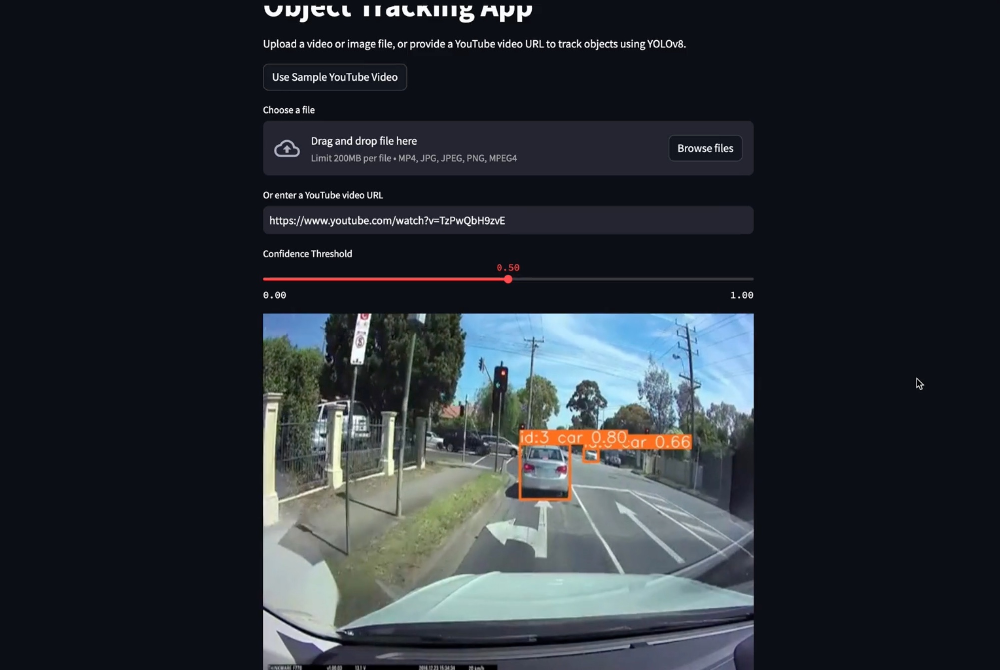
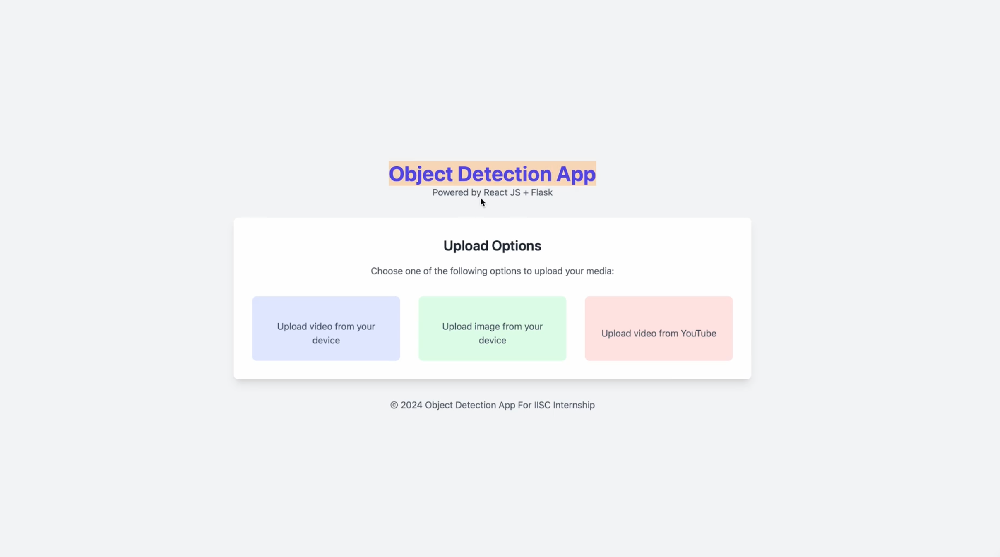

# Project Title: Traffic Object Detection

This is a comprehensive project composed of a frontend, backend and prototype architecture designed to interact synergistically for an ambitious task - Traffic Object Detection!

Features include the ability to upload an image, upload a YouTube link, as well as visualise videos frame by frame. The backend of this project is constructed using Flask, while the frontend is beautifully rendered using ReactJS and Tailwind CSS.

## Video Explanation 
https://github.com/Trident09/Attendance-frontend/assets/98939183/c0e4dd47-f6b8-4606-8517-1a3ae2657f7d

## Prototype
The prototype is built with Streamlit, a fast, elegant, and interactive tool for building data science web applications. The attached illustration of car detection has been achieved using this functionality.


## Frontend
The UI has been crafted with an attention to detail using the increasingly popular Tailwind CSS in conjunction with ReactJS. The interface delivers users intuitive and visually pleasing interactivity at every step of their navigation.


Let's dive into running this application right away in your local setup!

## Build and Run Docker
Kickstart the application via Docker with the following command:
```bash
docker-compose up --build
```

## Test Streamlit ProtoType
The Streamlit prototype can be experimented with and tested locally using the command:
```bash
streamlit run app.py
```

## Test Webapp
You can run the entire webapp locally after installing the necessary dependencies and running the file as given below:

```bash
pip install -r requirements.txt
python app.py
```

# Frontend
Necessary frontend dependencies can be set up and the interface can be run using:
```bash
npm install
npm start
```
